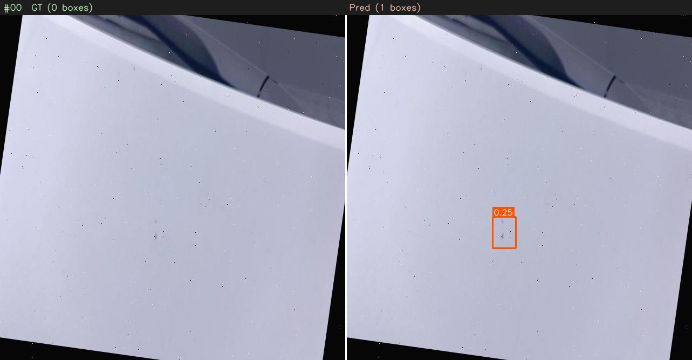
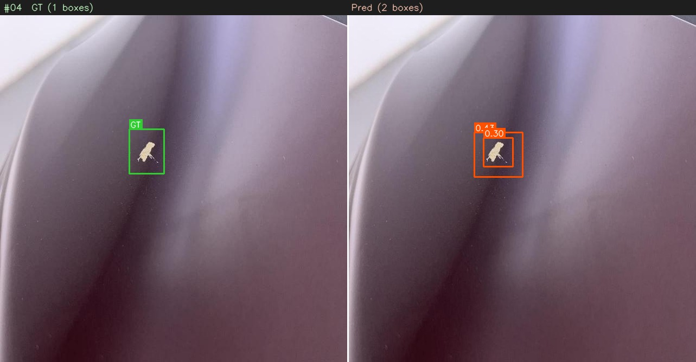
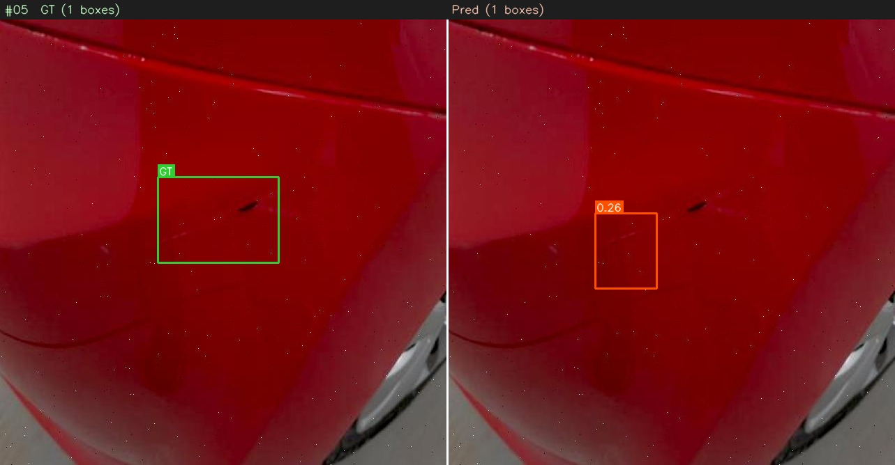

# Small MRF Detection Model

A compact PyTorch object-detection project for damage / MRF detection built around a multi-receptive-field backbone, FPN-style fusion neck, and decoupled classification/regression heads.

This repository is designed for experiments on image-level damage detection, with configurable training, augmentation, evaluation, and checkpointing.

## Example predictions

The repository includes evaluation visualizations in `eval_images/` to show ground truth vs. predicted detections.

<p align="center">
  
  
  
</p>

## Training

From the project root:

```bash
python train.py
```

Optional flags:

- `--epochs`
- `--batch_size`
- `--checkpoint_dir`
- `--log_dir`
- `--resume`

## Evaluation

```bash
python eval.py
```

You can also override the confidence threshold with:

```bash
python eval.py
```

## Notes

- The config file controls model depth, learning rate, augmentation, and NMS behavior.
- Checkpoints are saved under `checkpoints/` by default.
- The training code uses EMA, warmup, cosine decay, and optional fine-tuning phases.
